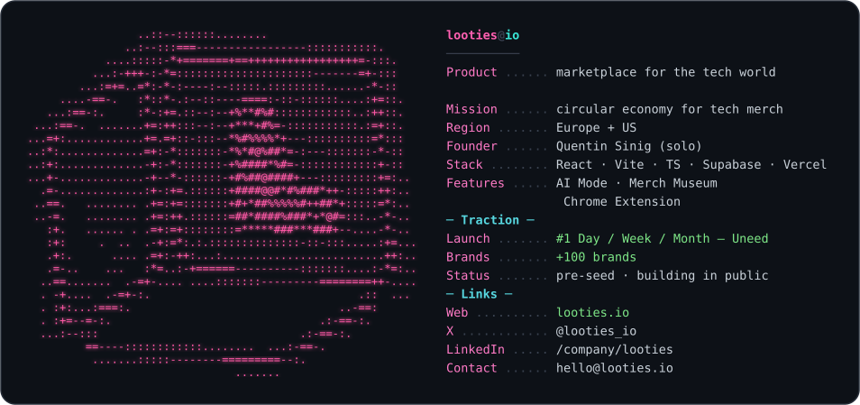

  
  
  

  
  
  
  
  

## Dev Skills

- [a11y-audit](https://github.com/looties-io/looties-skills/tree/main/a11y-audit)
- [changelog-to-video](https://github.com/looties-io/looties-skills/tree/main/changelog-to-video)
- [cinematic-hyperframes](https://github.com/looties-io/looties-skills/tree/main/cinematic-hyperframes)
- [code-cleanup](https://github.com/looties-io/looties-skills/tree/main/code-cleanup)
- [google-ai-seo-fundamentals](https://github.com/looties-io/looties-skills/tree/main/google-ai-seo-fundamentals)
- [google-ai-seo-optimization](https://github.com/looties-io/looties-skills/tree/main/google-ai-seo-optimization)
- [harness-testing](https://github.com/looties-io/looties-skills/tree/main/harness-testing)
- [website-ai-agent-readiness](https://github.com/looties-io/looties-skills/tree/main/website-ai-agent-readiness)
